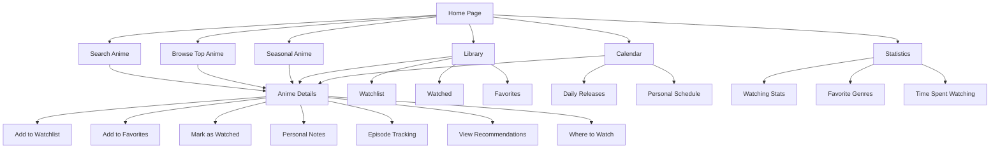

# AnimeTracker


## Overview

AnimeTracker is a comprehensive anime tracking application built with React and TypeScript. It provides users with a centralized platform to discover, manage, and track their anime watching progress. The application leverages the Jikan API for anime data, implements responsive design with TailwindCSS, and enhances user experience with smooth animations via Framer Motion. All data is stored locally, allowing users to maintain their tracking information without requiring a server connection.

## Features

### Core Functionality
- **Search & Discovery:** Fast and responsive anime search with instant results and advanced filtering options
- **Library Management:** Add anime to "Watchlist", "Watched", "Watching", and "Favorites" lists
- **Collection System:** Create custom collections to organize anime by personal categories
- **Detailed Information:** Comprehensive anime details including synopsis, ratings, genres, studios, and related anime
- **Streaming Information:** See which platforms an anime is available on with direct links
- **Personal Notes:** Add personal ratings (1-5 stars) and detailed notes for each anime
- **Episode Tracking:** Keep track of which episodes you've watched with intuitive +/- controls

### Advanced Features
- **Calendar View:** Browse airing schedule by day of the week with filtering options for SFW content and children's shows
- **Personal Schedule:** Auto-generated watching schedule based on your watchlist with airing days and times
- **Statistics Dashboard:** View analytics about your watching habits, favorite genres, and time spent watching
- **Recommendations:** Get personalized anime recommendations based on your watch history
- **Character Information:** View detailed character information and voice actors
- **Related Content:** Discover related anime and adaptations with direct links
- **Dark/Light Mode:** Toggle between visual themes with smooth transitions
- **Toast Notifications:** Receive feedback for actions with customized toast messages
- **Responsive Design:** Optimized experience across desktop and mobile devices with fluid animations

## Site Flow



## Technologies Used

- **Frontend Framework:** React 18 with TypeScript
- **Build Tool:** Vite
- **State Management:** React Context API and Zustand
- **Styling:** TailwindCSS with dark/light mode support
- **Animations:** Framer Motion
- **Icons:** Lucide React
- **Routing:** React Router v6
- **API Integration:** Axios with custom rate limiting and caching
- **Data Fetching:** TanStack Query (React Query)
- **Notifications:** React Toastify
- **Date Handling:** date-fns

## API Integration

This project uses the Jikan API (https://jikan.moe/) to fetch anime data. The API integration features:
- Smart caching to reduce API calls with customizable expiration times
- Rate limiting to respect API usage guidelines
- Error handling with retry logic for failed requests
- Data transformation for optimized frontend usage
- Dedicated endpoints for anime details, recommendations, schedules, and character information

## Getting Started

### Prerequisites
- Node.js 16+
- npm or yarn

### Installation
1. Clone the repository
```bash
git clone https://github.com/yourusername/anime-tracker.git
cd anime-tracker
```

2. Install dependencies
```bash
npm install
# or
yarn install
```

3. Start the development server
```bash
npm run dev
# or
yarn dev
```

4. Open your browser and navigate to `http://localhost:5173`

## Project Structure

```
anime-tracker/
├── src/
│   ├── components/     # Reusable UI components
│   ├── context/        # React context providers
│   ├── lib/            # Utilities, API clients, and store
│   ├── pages/          # Page components
│   ├── styles/         # Global styles and theme
│   ├── App.tsx         # Application entry point
│   └── main.tsx        # React render
├── public/             # Static assets
├── index.html
├── package.json
├── tsconfig.json
└── vite.config.ts
```

## Future Enhancements

- User authentication and cloud sync
- Social features to share and recommend anime
- Mobile app with React Native
- Offline support
- More detailed analytics and insights
- Manga tracking integration

---

Created with by João Khalaf